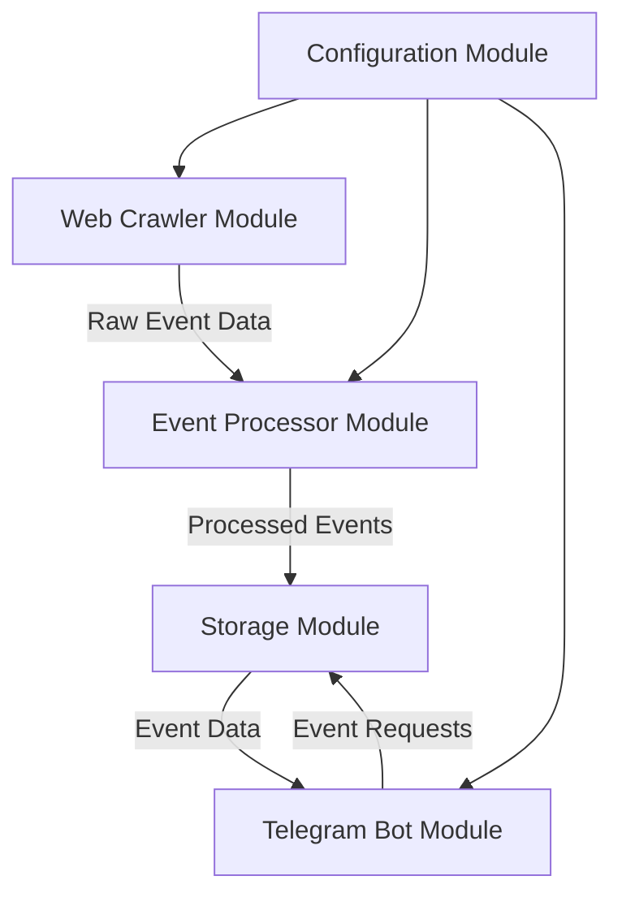
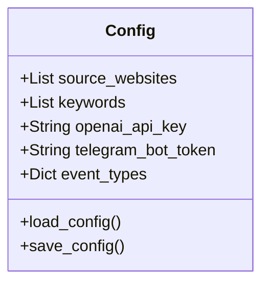
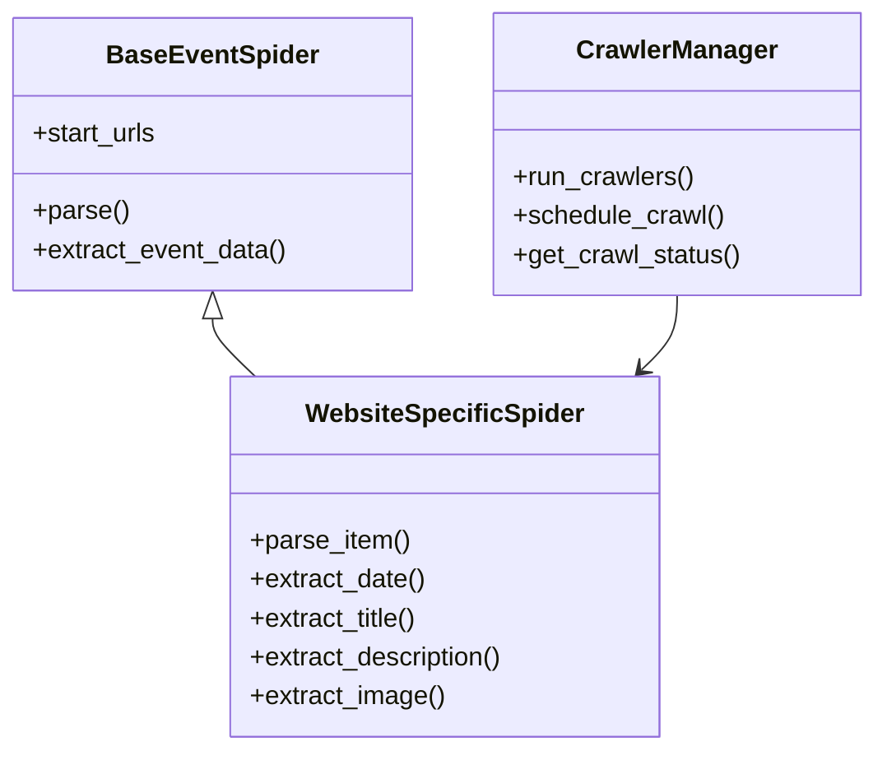
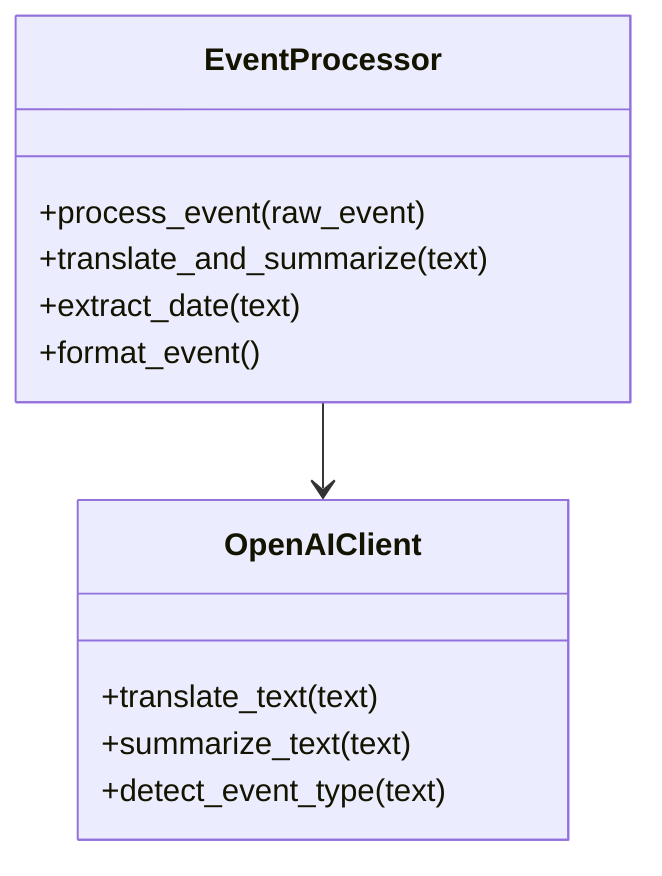
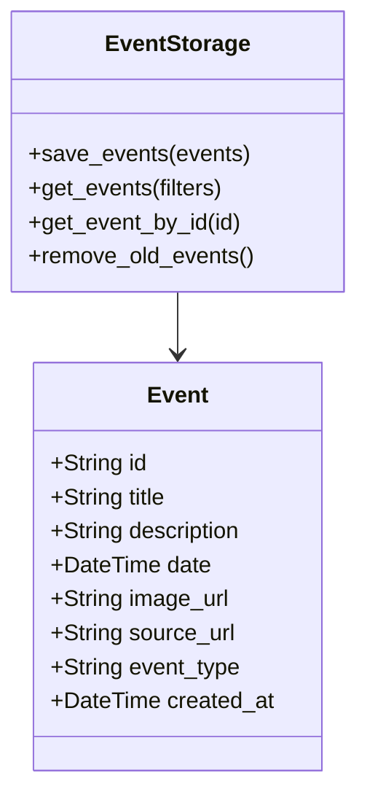
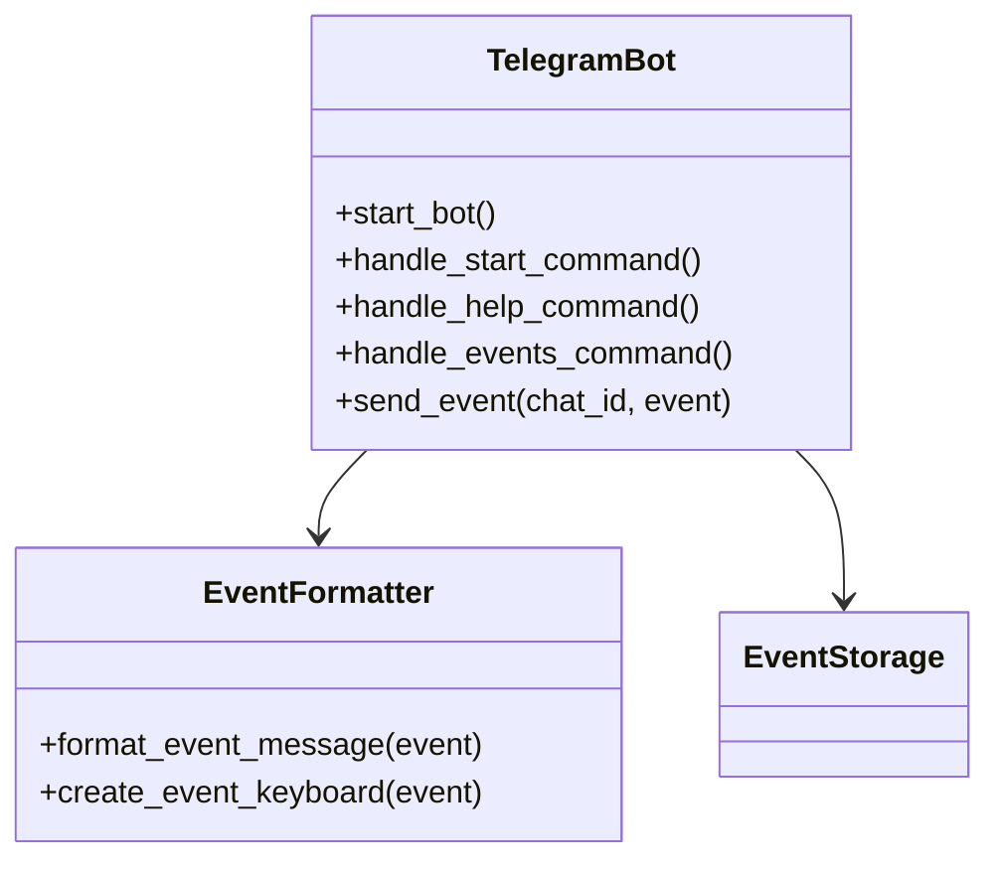
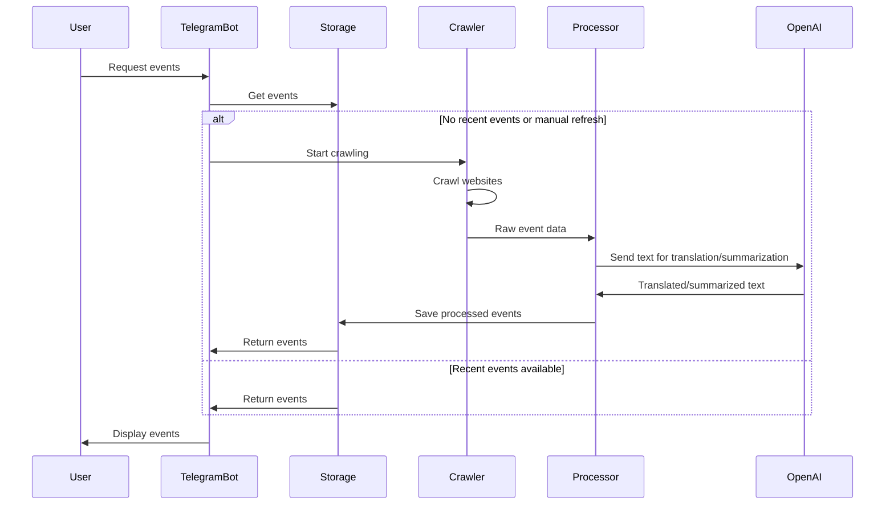

# Tourist Event Collection System - Architecture Plan

## 1. System Overview

The system will collect tourist events from various Italian websites, process them, and make them available through a Telegram bot. Here's a high-level overview of the architecture:



## 2. Core Components

### 2.1. Configuration Module

This module will handle all configuration settings for the system:



- Stores source websites and their scraping rules
- Manages API keys (OpenAI, Telegram)
- Defines keywords for event filtering
- Configures event types and categories
- Handles other system settings

### 2.2. Web Crawler Module

This module will use Scrapy to crawl the specified websites and extract event information:



- Implements a base spider class with common functionality
- Creates specific spiders for each target website
- Extracts raw event data (title, description, date, image URL, source URL)
- Implements filtering based on keywords and event types
- Handles pagination and follows links to event details
- Manages crawling process and error handling

### 2.3. Event Processor Module

This module will process the raw event data:



- Cleans and normalizes raw event data
- Uses OpenAI API to translate and summarize descriptions
- Extracts and formats event dates
- Validates event data
- Prepares final event structure for storage

### 2.4. Storage Module

This module will handle storing and retrieving event data:



- Implements JSON file-based storage
- Provides methods to save and retrieve events
- Handles data persistence
- Implements filtering and sorting capabilities
- Manages data cleanup (removing old events)

### 2.5. Telegram Bot Module

This module will implement the Telegram bot interface:



- Implements bot commands (/start, /help, /events)
- Handles user interactions and requests
- Formats and sends event information
- Implements pagination for multiple events
- Provides filtering options (by date, type, etc.)

## 3. Data Flow



## 4. Implementation Plan

### 4.1. Project Structure

```
tourist_events/
├── config/
│   ├── config.json           # Main configuration file
│   └── website_rules.json    # Website-specific scraping rules
├── crawler/
│   ├── __init__.py
│   ├── spiders/              # Scrapy spiders for each website
│   │   ├── __init__.py
│   │   ├── base_spider.py
│   │   ├── ilvescovado_spider.py
│   │   ├── salernotoday_spider.py
│   │   └── ...
│   ├── items.py              # Scrapy item definitions
│   ├── middlewares.py        # Scrapy middlewares
│   ├── pipelines.py          # Scrapy pipelines
│   └── settings.py           # Scrapy settings
├── processor/
│   ├── __init__.py
│   ├── event_processor.py    # Event processing logic
│   ├── openai_client.py      # OpenAI API client
│   └── date_extractor.py     # Date extraction utilities
├── storage/
│   ├── __init__.py
│   ├── event_storage.py      # Storage implementation
│   └── models.py             # Data models
├── telegram_bot/
│   ├── __init__.py
│   ├── bot.py                # Telegram bot implementation
│   ├── handlers.py           # Command handlers
│   └── formatters.py         # Message formatting utilities
├── utils/
│   ├── __init__.py
│   ├── logger.py             # Logging utilities
│   └── helpers.py            # Helper functions
├── data/
│   └── events.json           # Stored events
├── logs/                     # Log files
├── main.py                   # Main entry point
├── requirements.txt          # Dependencies
└── README.md                 # Documentation
```

### 4.2. Implementation Phases

#### Phase 1: Setup and Configuration
1. Set up project structure
2. Create configuration module
3. Define data models
4. Set up logging

#### Phase 2: Web Crawler Implementation
1. Implement base spider class
2. Create website-specific spiders for initial websites
3. Implement filtering logic
4. Test crawling functionality

#### Phase 3: Event Processing
1. Implement OpenAI client
2. Create event processor
3. Implement date extraction
4. Test processing pipeline

#### Phase 4: Storage Implementation
1. Implement JSON storage
2. Create methods for saving and retrieving events
3. Implement data cleanup
4. Test storage functionality

#### Phase 5: Telegram Bot Implementation
1. Set up bot with basic commands
2. Implement event display functionality
3. Add filtering and pagination
4. Test bot interactions

#### Phase 6: Integration and Testing
1. Integrate all components
2. Implement error handling and recovery
3. Perform end-to-end testing
4. Optimize performance

#### Phase 7: Documentation and Deployment
1. Complete documentation
2. Create setup and usage instructions
3. Prepare for deployment
4. Final testing

## 5. Technical Specifications

### 5.1. Dependencies

- **Python**: 3.8+
- **Scrapy**: Web crawling framework
- **OpenAI API**: For translation and summarization
- **python-telegram-bot**: For Telegram bot implementation
- **Pillow**: For image processing
- **dateparser**: For extracting and parsing dates
- **requests**: For HTTP requests
- **beautifulsoup4**: For HTML parsing (as a backup/helper to Scrapy)
- **python-dotenv**: For environment variable management

### 5.2. Error Handling Strategy

- Implement comprehensive logging
- Use try-except blocks for critical operations
- Implement retries for API calls and web requests
- Create fallback mechanisms for critical components
- Monitor and alert on system failures

### 5.3. Performance Considerations

- Implement caching for API responses
- Use asynchronous processing where appropriate
- Optimize crawling frequency and depth
- Implement rate limiting for external APIs
- Use efficient data structures and algorithms

## 6. Future Enhancements

- Implement machine learning for better event filtering
- Add support for more event sources
- Create a web interface for configuration
- Implement user preferences and personalized recommendations
- Add support for multiple languages
- Implement automatic discovery of new event sources